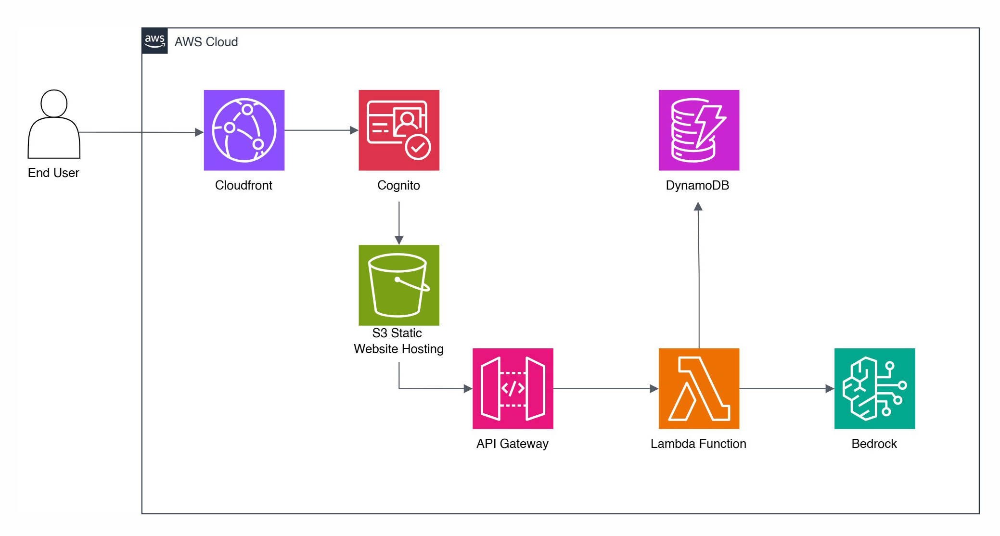
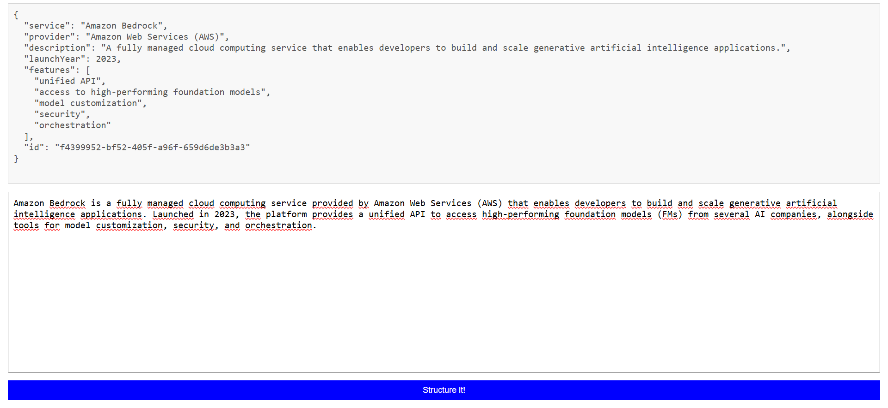
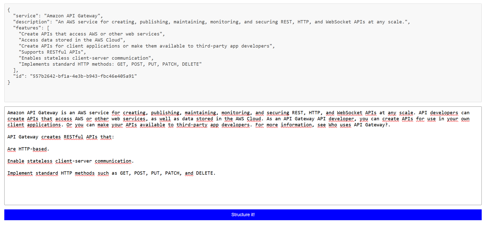
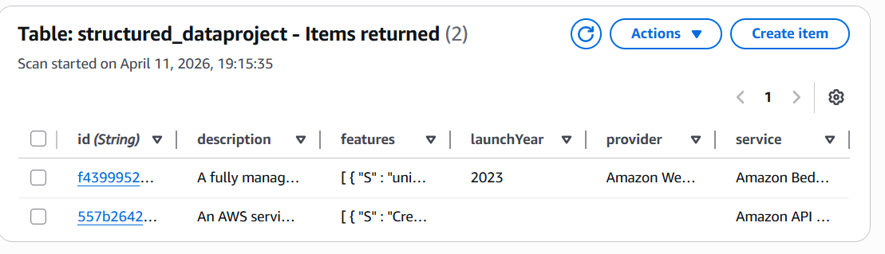

# Structure Your Data!



This is the cloud system I designed to structure data with the help of
Bedrock and Amazon Nova Micro LLM in an AWS free tier account. This
simple system converts user inputs into JSON format, displays it on the
web interface, and writes the data into DynamoDB. The objective of this
system is to create a basis for the daily business tasks when
unstructured data needs to be converted into structured data to increase
efficiency in data operations. Instead of manually structuring the data,
LLM with prompt engineering will save time, and thanks to the
serverless, less costly models in Bedrock, the company will save money.
Terraform will automatically deploy most of the system. Prompt
engineering is a good method to structure data and the model response. A
sample I/O is below:

User input:
```
Hello! I am a graduate student and my major is IT!
```
Output:
```
{
  "name": "Graduate Student",
  "major": "IT",
  "id": "a31b6166-e799-4052-a6dd-69f1019900d9"
}
```

How to start CI/CD automation step-by-step:

1.  Fork the entire Git.

2.  Define the following secrets on Secrets and Variables

```AWS_ACCESS_KEY_ID```

```AWS_SECRET_ACCESS_KEY```

```S3_BUCKET_NAME```

Please note that you must create an IAM user with least privilege authorization 
to the services on the cloud system above for GitHub. The S3 bucket name
must be unique globally. In case of an error, you should remove all the
AWS services manually and start the deployment from GitHub Actions one
more time.

3.  On the GitHub Actions menu, start the continuous development
    manually.

Finally, Terraform will issue the global S3 address. After clicking on
the link, you can start typing unstructured information. When you click
on the “Structure It!” button, the web UI will display the results and
save the table into DynamoDB. Enjoy structuring your complicated data!

Please note that all the deployment process is automated. You don’t need
to manually insert the lambda code or change the API path on the index
file.






Improvements
+ Added sign up and user management feature using Cognito
 
