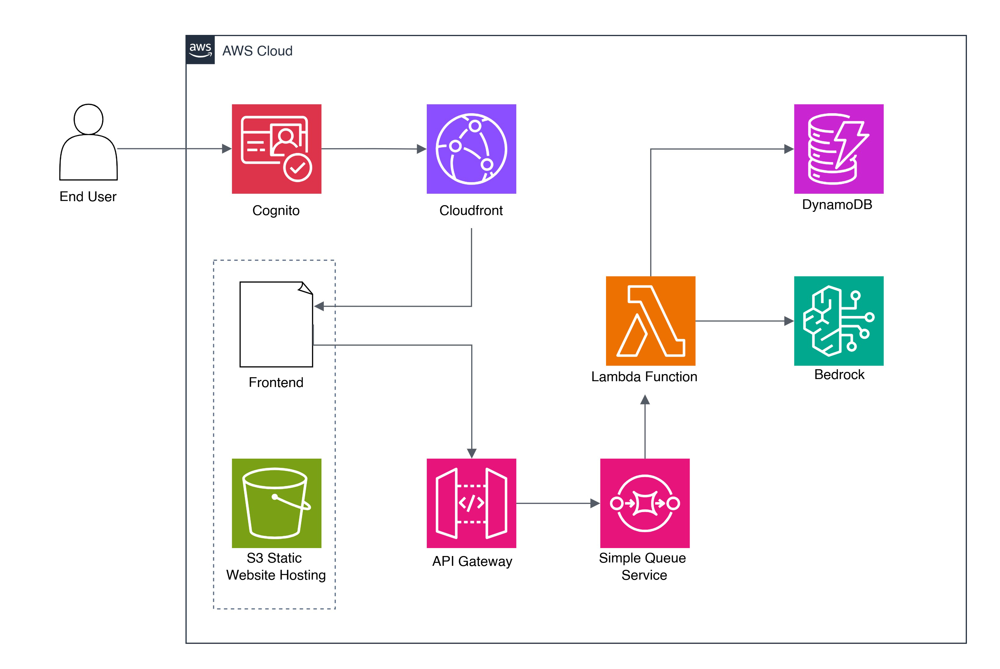
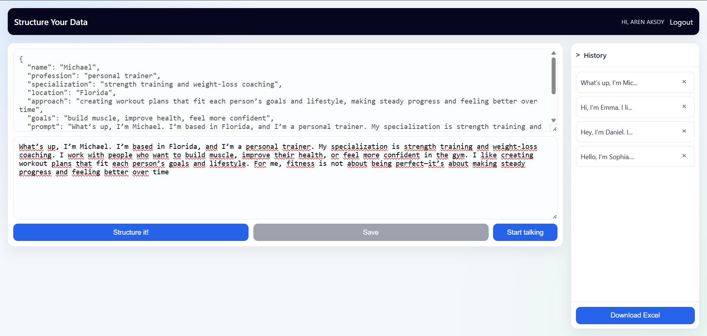
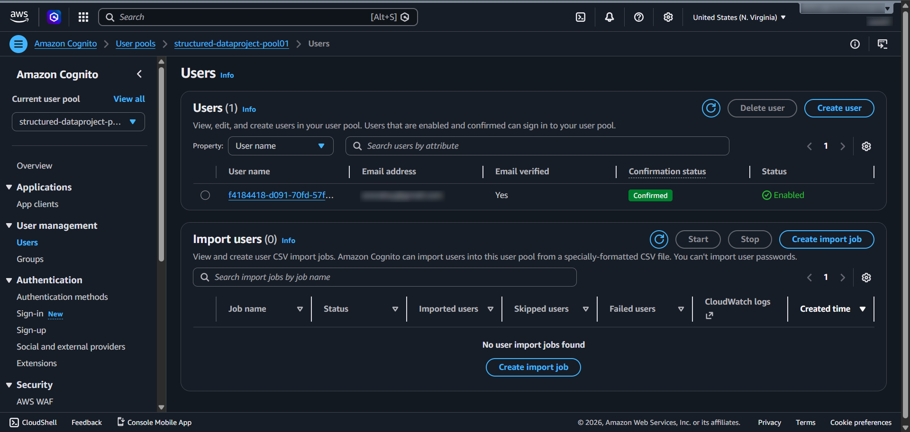
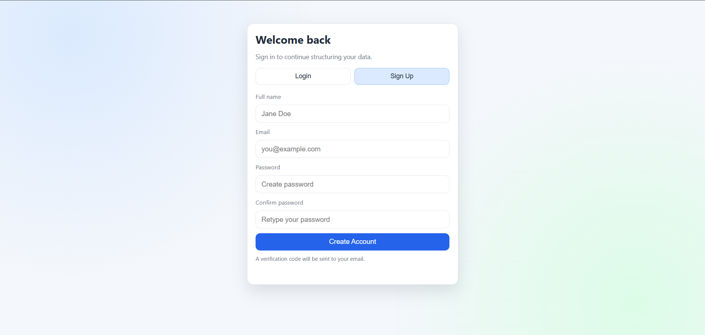
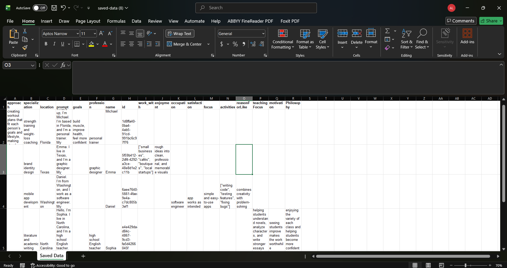

# Structure Your Data!



This is the cloud system I designed to structure data with the help of
Bedrock and Amazon Nova Micro LLM in an AWS free tier account. 

- This system converts user inputs into JSON format, displays it on the
web interface, and writes the data into DynamoDB. 

- The objective is to create a basis for the daily business tasks when
unstructured data needs to be converted into structured data to increase
efficiency in data operations.

- Instead of manually structuring the data, LLM with prompt engineering will save time, and thanks to the
serverless architecture and less costly models in Bedrock, it will be affordable for startups.

- Terraform will automatically deploy most of the system. SQS limits the requests per second to prevent overloading.

- The system also includes user register and sign in pages, and the users are authorized through Cognito. 

- There are some functions in the app such as saving your data as an XLSX file, reviewing your history, and speaking through speech-to-text feature. 

- Smarter LLMs will display better results. It is possible to change LLM in the Lambda Function, but for the free tier accounts, others will not be allowed.

- AWS Transcribe is not integrated into that system to transcribe users' speech as it would be highly expensive. Instead, browser based JS library is used (s3-frontend/speech-to-text.js). 

A sample I/O is below for a single prompt:

User input:
```
Amazon Web Services, Inc. (AWS) is a subsidiary of Amazon that provides on-demand cloud computing platforms and APIs to individuals, companies, and governments, on a metered, pay-as-you-go basis.

Clients often use this in combination with autoscaling (a process that allows a client to use more computing in times of high application usage, and then scale down to reduce costs when there is less traffic). These cloud computing web services provide various services related to networking, compute, storage, middleware, IoT and other processing capacity, as well as software tools via AWS server farms. This frees clients from managing, scaling, and patching hardware and operating systems.

One of the foundational services is Amazon Elastic Compute Cloud (EC2), which allows users to have at their disposal a virtual cluster of computers, with extremely high availability, which can be interacted with over the internet via REST APIs, a CLI or the AWS console. AWS's virtual computers emulate most of the attributes of a real computer, including hardware central processing units (CPUs) and graphics processing units (GPUs) for processing; local/RAM memory; hard-disk (HDD)/SSD storage; a choice of operating systems; networking; and pre-loaded application software such as web servers, databases, and customer relationship management (CRM).
```
Output:
```

{
  "foundationalService": "Amazon Elastic Compute Cloud (EC2)",
  "emulatedAttributes": [
    "hardware CPUs",
    "GPUs",
    "local/RAM memory",
    "HDD/SSD storage",
    "operating systems",
    "networking",
    "pre-loaded application software"
  ],
  "description": "provides on-demand cloud computing platforms and APIs to individuals, companies, and governments on a metered, pay-as-you-go basis.",
  "features": [
    "autoscaling",
    "networking",
    "compute",
    "storage",
    "middleware",
    "IoT",
    "software tools"
  ],
  "company": "Amazon Web Services, Inc. (AWS)",
  "EC2Description": "virtual cluster of computers with high availability, interacted with via REST APIs, CLI, or AWS console"
}
```
## How to Deploy

To start CI/CD automation step-by-step:

1.  Fork the entire Git.

2.  Define the following secrets on Secrets and Variables

```AWS_ROLE_TO_ASSUME```

```S3_BUCKET_NAME```

Please note that you must create an IAM user with least privilege authorization 
to the services on the cloud system above for GitHub. Please see the related file [least-privilige-policy.json](./least-privilege-policy.json).

This repository includes [destroy.yml](./.github/workflows/destroy.yml) file to destroy the infrastructure in the cloud. Please be sure that GitHub actions role is authorized to delete these services. The S3 bucket name
must be unique globally. In case of an error, you should remove all the
AWS services and start the deployment from GitHub Actions one
more time.

3.  On the GitHub Actions menu, start the continuous development
    manually.

Finally, Terraform will issue the global S3 address. After clicking on
the link, you can start typing unstructured information. When you click
on the “Structure It!” button, the web UI will display the results and
save the table into DynamoDB. Enjoy structuring your complicated data!

Please note that all the deployment process is automated. You do not need
to manually insert the Lambda code or change the API path on the index
file. This app also opens a Terraform State Bucket in S3 to track the changes.

## Screenshots





## Security Improvements
- Instead of connecting API Gateway directly with Lambda, SQS processes the requrests and sends them to the Lambda Function. [Structured Data Function](https://github.com/aren-01/structure-dataproject/blob/main/lambda-function/structured_dataproject.py#L162)

- Lambda function limits the user prompt to a maximum of 500 words and 8000 characters. 

- Lambda function limits the daily requests to a maximum of 50 prompts by default.

- API Gateway access is authorized by Cognito. Even though if someone attempts to change frontend, they will not be able to use this app's functions.

- SQS prevents sending multiple requrests to Bedrock at the same time.


 
